# B-Splines
*Author: Ahmed Ratnani*

Given a subdivision $\{x_0 <  x_1 < \cdots < x_r\}$ of the interval $I = [x_0, x_r]$, the \textbf{Schoenberg space} is the space of piecewise polynomials of degree $p$, on the interval $I$ and given regularities $\{k_1, k_2, \cdots, k_{r-1}\}$ at the internal points $\{x_1, x_2, \cdots, x_{r-1}\}$. 

Given $m$ and $p$ as natural numbers, let us consider a sequence of non decreasing real numbers $T=\{t_i\}_{0\leqslant i \leqslant m}$. $T$ is called **knots sequence**. From a knots sequence, we can generate a B-splines family using the reccurence formula \ref{eq:bspline-reccurence}.

````{prf:definition} B-Splines using Cox-DeBoor Formula
:label: def-bspline 
The j-th B-spline of degree $p$ is defined by the recurrence relation:

$$
\begin{align}
  N_j^p = \frac{t-t_j}{t_{j+p}-t_{j}} N_j^{p-1} + \frac{t_{j+p+1}-t}{t_{j+p+1}-t_{j+1}} N_{j+1}^{p-1},
  \label{eq:bspline-reccurence}
\end{align}
$$

where

$$
N_j^0(t) = \chi_{ \left[ t_j, t_{j+1} \right[ }(t)
$$

for $0 \leq j \leq m-p-1$.
````

```{prf:remark}
  When working with Bernstein polynomials, we introduced the convention $B_i^n=0$ for all $i<0$ or $i>n$. For B-Splines, we have a similar convetion $N_j^p=0$ if $j<0$ or $j>n$. In addition, we also assume $\frac{0}{0} = 0$, when using the formula \ref{eq:bspline-reccurence} and $N_j^0 = 0$ if $t_j = t_{j+1}$.
```

```python
# needed imports
import numpy as np
from numpy import empty
import matplotlib.pyplot as plt
```

````{prf:example}
:label: bsplines-ex-1

We consider a linear B-Spline with the knot vector $T = [0, 1, 2]$


```python
def N1_0(t):
    if t >= 0 and t< 1: return t
    if t >= 1 and t< 2: return 2-t
    return 0.

xs = np.linspace(0., 2., 200)
plt.plot(xs, [N1_0(x) for x in xs], label='$N_0^1$')
plt.legend()
```
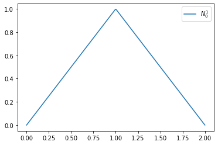
````

````{prf:example}
:label: bsplines-ex-2

We consider a linear B-Spline with the knot vector $T = [0, 0, 1]$

```python
def N1_0(t):
    if t >= 0 and t< 1: return 1-t
    return 0.

xs = np.linspace(0., 1., 200)
plt.plot(xs, [N1_0(x) for x in xs], label='$N_0^1$')
plt.legend()
```
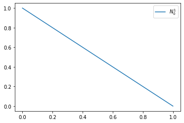
````

````{prf:example}
:label: bsplines-ex-3

We consider a linear B-Spline with the knot vector $T = [0, 1, 1]$

```python
def N1_0(t):
    if t >= 0 and t< 1: return t
    return 0.

xs = np.linspace(0., 1., 201)[:-1]
plt.plot(xs, [N1_0(x) for x in xs], label='$N_0^1$')
plt.legend()
```
    
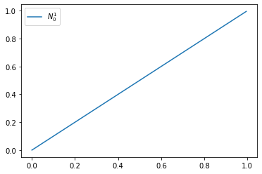
````

````{prf:example}
:label: bsplines-ex-4

We consider linear B-Splines with the knot vector $T = [0, 0, 1, 1]$

```python
def N1_0(t):
    if t >= 0 and t< 1: return 1-t
    return 0.

def N1_1(t):
    if t >= 0 and t< 1: return t
    return 0.

xs = np.linspace(0., 1., 201)[:-1]
plt.plot(xs, [N1_0(x) for x in xs], label='$N_0^1$')
plt.plot(xs, [N1_1(x) for x in xs], label='$N_1^1$')
plt.legend()
```
    
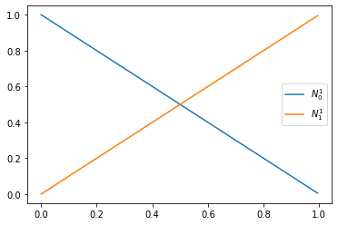
````

````{prf:example}
:label: bsplines-ex-5

We consider linear B-Splines with the knot vector $T = [0, 0, 1, 2]$

```python
def N1_0(t):
    if t >= 0 and t< 1: return 1-t
    return 0.

def N1_1(t):
    if t >= 0 and t< 1: return t
    if t >= 1 and t< 2: return 2-t
    return 0.

xs = np.linspace(0., 2., 201)[:-1]
plt.plot(xs, [N1_0(x) for x in xs], label='$N_0^1$')
plt.plot(xs, [N1_1(x) for x in xs], label='$N_1^1$')
plt.legend()
```
    
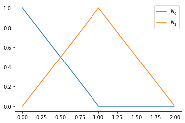
````
    
````{prf:example}
:label: bsplines-ex-6

We consider a quadratic B-Spline with the knot vector $T = [0, 0, 1, 1]$

```python
def N2_0(t):
    if t >= 0 and t< 1: return 2*t*(1-t)
    return 0.

xs = np.linspace(0., 1., 201)[:-1]
plt.plot(xs, [N2_0(x) for x in xs], label='$N_0^2$')
plt.legend()
```
    
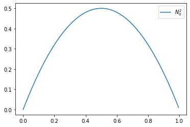
````

````{prf:example}
:label: bsplines-ex-7

We consider a quadratic B-Spline with the knot vector $T = [0, 0, 1, 2]$


```python
T = [0, 0, 1, 2]
def N2_0(t):
    if t >= 0 and t< 1: return 2*t-3./2.*t**2
    if t >= 1 and t< 2: return 0.5*(2-t)**2
    return 0.

xs = np.linspace(0., 2., 200)
plt.plot(xs, [N2_0(x) for x in xs], label='$N_0^2$')
plt.legend()
```

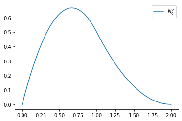
````

````{prf:example}
:label: bsplines-ex-8

We consider linear B-Splines with the knot vector $T = [0, 0, 1, 2, 3, 3]$

```python
def N1_0(t):
    if t >= 0 and t< 1: return 1-t
    return 0.

def N1_1(t):
    if t >= 0 and t< 1: return t
    if t >= 1 and t< 2: return 2-t
    return 0.

def N1_2(t):
    if t >= 1 and t< 2: return t-1
    if t >= 2 and t< 3: return 3-t
    return 0.

def N1_3(t):
    if t >= 2 and t< 3: return t-2
    return 0.


xs = np.linspace(0., 3., 201)[:-1]
plt.plot(xs, [N1_0(x) for x in xs], label='$N_0^1$')
plt.plot(xs, [N1_1(x) for x in xs], label='$N_1^1$')
plt.plot(xs, [N1_2(x) for x in xs], label='$N_2^1$')
plt.plot(xs, [N1_3(x) for x in xs], label='$N_3^1$')
plt.legend()
```
    
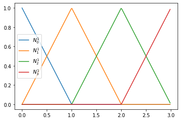
````

````{prf:example}
:label: bsplines-ex-9

We consider quadratic B-Splines with the knot vector $T = [0, 0, 0, 1, 1, 1]$

```python
def N2_0(t):
    if t >= 0 and t< 1: return (1-t)**2
    return 0.

def N2_1(t):
    if t >= 0 and t< 1: return 2*t*(1-t)
    return 0.

def N2_2(t):
    if t >= 0 and t< 1: return t**2
    return 0.

xs = np.linspace(0., 1., 201)[:-1]
plt.plot(xs, [N2_0(x) for x in xs], label='$N_0^2$')
plt.plot(xs, [N2_1(x) for x in xs], label='$N_1^2$')
plt.plot(xs, [N2_2(x) for x in xs], label='$N_2^2$')
plt.legend()
```

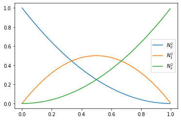
````

## B-Splines properties

B-Splines have many interesting properties that are listed below. In general, most of the proofs are done by induction on the B-Spline degree. 

````{prf:proposition}
  B-splines are piecewise polynomial of degree $p$
````

```{prf:remark}
  The B-splines functions associated to open knots sequences without internal knots, \textit{i.e.} the length of the knots sequence is exactly $2p+2$, are the Bernstein polynomials of degree$p$.
```

````{prf:proposition} compact support
  $N_j^p(t) = 0$ for all $t \notin [t_j, t_{j+p+1})$.
````

````{prf:proposition}
  \label{prop:non-vanishing-bsplines}
  If $t \in~ [ t_j,t_{j+1} ) $, then only the \textit{B-splines} $\{ N_{j-p}^p,\cdots,N_{j}^p \}$ are non vanishing at $t$.
````


````{prf:proposition} non-negativity
  $N_j^p(t) \ge 0, \quad \forall t \in [ t_j, t_{j+p+1} ) $
````

````{prf:proposition} Partition of unity
  $\sum N_i^{p}(t) = 1, \forall t \in \mathbb{R}$
````

```{prf:remark}
The previous sum $\sum N_i^{p}(t)$ has a meaning since for every $t \in \mathbb{R}$, only $p+1$ B-Splines are non-vanishing.
```

```{prf:remark}
  For the sake of simplicity, we shall avoid using summation indices on linear expansion of B-Splines.
```

````{prf:lemma}
$$
  \begin{align}
  \sum a_j N_j^p = \sum \left(\frac{t_{j+p}-t}{t_{j+p}-t_{j}}a_{j-1} + \frac{t-t_j}{t_{j+p}-t_{j}} a_j\right) N_j^{p-1}  
  \end{align}
$$
````

````{prf:proposition} Marsden's idenity
$$
  \begin{align}
    \left( x-y \right)^p = \sum\limits_{j} \rho_j^p(y) N_j^p(x)
    \label{eq:marsden-spline}
  \end{align}
$$

where 

$$
  \begin{align}
    \rho_j^p(y) = \prod\limits_{i=j+1}^{j+p} (t_{i} -y)   
  \end{align}
$$
````

Thanks to Marsden's identity and the proposition \ref{prop:non-vanishing-bsplines}, we now are able to prove the local linear independence of the B-Splines basis functions.

````{prf:proposition} Local linear independence
  On each interval $[t_j, t_{j+1})$, the B-Splines are lineary independent.
````

```{prf:remark}
  We will see in the Approximation theory part, that the B-Splines family has also a global linear independence property.
```

````{prf:proposition} Derivatives of B-Splines
The derivative of B-Splines can be computed reccursivly by deriving the formula \ref{eq:bspline-reccurence}, which gives

$$
\begin{align}
  {N_j^p}^\prime = \frac{p}{t_{j+p}-t_{j}} N_j^{p-1} - \frac{p}{t_{j+p+1}-t_{j+1}} N_{j+1}^{p-1}
  \label{eq:bspline-ders-reccurence}
\end{align}
$$

````
    
## Evaluation of B-Splines

Given a knot sequence $T=\{t_i\}_{0\leqslant i \leqslant n + p}$, we are interested in the algorithmic evaluation of B-Splines of degree $p$. 

```{warning}
Add evaluation diagram
```

For a given real point $x$, it is done in two steps:

1. find the knot span index $j$, such that $x \in~ ] t_j,t_{j+1} [ $  
2. evaluate all non-vanishing B-Splines $N_{j-p}^p, \cdots, N_j^p$ 

The first point is achieved by the function implemented by the following function:

```python
def find_span( knots, degree, x ):
    # Knot index at left/right boundary
    low  = degree
    high = 0
    high = len(knots)-1-degree

    # Check if point is exactly on left/right boundary, or outside domain
    if x <= knots[low ]: returnVal = low
    elif x >= knots[high]: returnVal = high-1
    else:
        # Perform binary search
        span = (low+high)//2
        while x < knots[span] or x >= knots[span+1]:
            if x < knots[span]:
                high = span
            else:
                low  = span
            span = (low+high)//2
        returnVal = span

    return returnVal
```

The second point is implemented by the following function, that returns all non-vanishing B-Splines at $x$


```python
def all_bsplines( knots, degree, x, span ):
    left   = empty( degree  , dtype=float )
    right  = empty( degree  , dtype=float )
    values = empty( degree+1, dtype=float )

    values[0] = 1.0
    for j in range(0,degree):
        left [j] = x - knots[span-j]
        right[j] = knots[span+1+j] - x
        saved    = 0.0
        for r in range(0,j+1):
            temp      = values[r] / (right[r] + left[j-r])
            values[r] = saved + right[r] * temp
            saved     = left[j-r] * temp
        values[j+1] = saved

    return values
```

The following function plots all B-Splines given a knot vector and a polynomial degree.


```python
def plot_splines(knots, degree, nx=100):
    xmin = knots[degree]
    xmax = knots[-degree-1]
    
    # grid points for evaluation
    xs = np.linspace(xmin,xmax,nx)

    # this is the number of the BSplines in the Schoenberg space
    N = len(knots) - degree - 1

    ys = np.zeros((N,nx), dtype=np.double)
    for ix,x in enumerate(xs):
        span = find_span( knots, degree, x )    
        b    = all_bsplines( knots, degree, x, span )  
        ys[span-degree:span+1, ix] = b[:]
        
    for i in range(0,N):
        plt.plot(xs,ys[i,:], label='$N_{}$'.format(i+1))
    plt.legend(loc=9, ncol=4)
```

## Knots vector families

There are two kind of **knots vectors**, called **clamped** and **unclamped**. Both families contains **uniform** and **non-uniform** sequences. 

The following are examples of such knots vectors

### Clamped knots (open knots vector)

#### uniform

````{prf:example}
:label: bsplines-ex-10

```python
T = np.array([0, 0, 0, 1, 2, 3, 4, 5, 5, 5])

plot_splines(T, degree=2, nx=100)
```
    
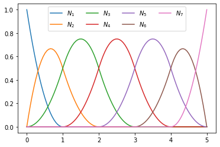
````

````{prf:example}
:label: bsplines-ex-11

```python
T = [-0.2, -0.2, 0.0, 0.2, 0.4, 0.6, 0.8, 0.8]

plot_splines(T, degree=2, nx=100)
```
    
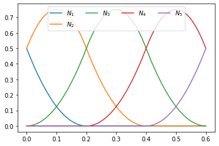
````    

#### non-uniform 

````{prf:example}
:label: bsplines-ex-12

```python
T = [0, 0, 0, 1, 3, 4, 5, 5, 5]

plot_splines(T, degree=2, nx=100)
```
    
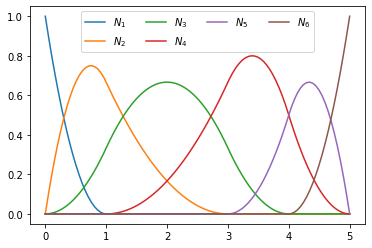
````


````{prf:example}
:label: bsplines-ex-13

```python
T = [-0.2, -0.2, 0.4, 0.6, 0.8, 0.8]

plot_splines(T, degree=2, nx=100)
```
    

````

### Unclamped knots

#### uniform

````{prf:example}
:label: bsplines-ex-14

```python
T = [0, 1, 2, 3, 4, 5, 6, 7, 8]

plot_splines(T, degree=2, nx=100)
```
    
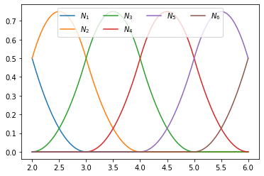
````
    

````{prf:example}
:label: bsplines-ex-15

```python
T = [-0.2, 0.0, 0.2, 0.4, 0.6, 0.8, 1.0]

plot_splines(T, degree=2, nx=100)
```
    
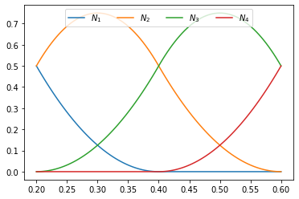
````

#### non-uniform 


````{prf:example}
:label: bsplines-ex-16

```python
T = [0, 0, 3, 4, 7, 8, 9]

plot_splines(T, degree=2, nx=100)
```
    
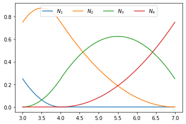
````    

````{prf:example}
:label: bsplines-ex-17

```python
T = [-0.2, 0.2, 0.4, 0.6, 1.0, 2.0, 2.5]

plot_splines(T, degree=2, nx=100)
```
    
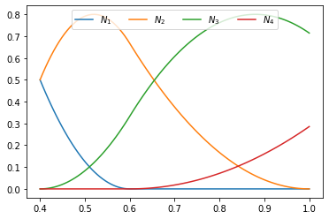
```` 
