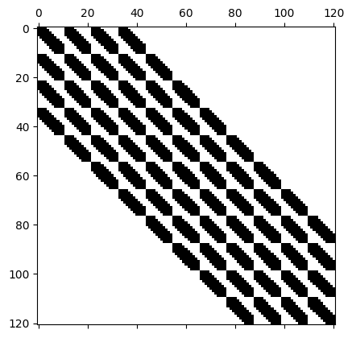

# Data Structure
*Author: Ahmed Ratnani*

In the sequel, we shall use **StencilMatrix** and **StencilVector** from the **psydac** library.

For the moment, we are only interested about having an appropriate data structure to store our computations.
Once the assembly is done, we will convert the matrix into a scipy sparse matrix, while the vector will be converted to numpy array.

We will see later how one can impose boundary conditions.

# 1D Case


```python
import numpy as np

from psydac.fem.splines import SplineSpace
from psydac.fem.tensor  import TensorFemSpace
from psydac.linalg.stencil import StencilMatrix
from psydac.linalg.stencil import StencilVector
from psydac.ddm.cart import DomainDecomposition
```


```python
from gallery_section_03 import assemble_stiffness_1d
from gallery_section_03 import assemble_vector_1d
```


```python
xmin = 0. ; xmax = 1.
nelements = 8
degree = 3
grid = np.linspace( xmin, xmax, num=nelements+1 )
V = SplineSpace(degree=degree, grid=grid)
dd = DomainDecomposition(ncells=[V.ncells], periods=[False])
V = TensorFemSpace(dd, V)
```


```python
stiffness = StencilMatrix(V.vector_space, V.vector_space)
```


```python
stiffness = assemble_stiffness_1d( V, matrix=stiffness )
```


```python
stiffness = stiffness.tosparse()
```


```python
f = lambda x: 2.    
```


```python
rhs = StencilVector(V.vector_space)
```


```python
rhs = assemble_vector_1d( f, V, rhs=rhs )
```


```python
rhs = rhs.toarray()
```

## 2D Case


```python
from gallery_section_03 import assemble_stiffness_2d
from gallery_section_03 import assemble_vector_2d
```


```python
x1min = 0. ; x1max = 1.
x2min = 0. ; x2max = 1.
nelements1 = 8
nelements2 = 8
degree1 = 3
degree2 = 3
grid1 = np.linspace( x1min, x1max, num=nelements1+1 )
grid2 = np.linspace( x2min, x2max, num=nelements2+1 )

V1 = SplineSpace(degree=degree1, grid=grid1)
V2 = SplineSpace(degree=degree2, grid=grid2)

dd = DomainDecomposition(ncells=[V1.ncells, V2.ncells], periods=[False, False])
V = TensorFemSpace(dd, V1, V2)
```


```python
stiffness = StencilMatrix(V.vector_space, V.vector_space)
```


```python
stiffness = assemble_stiffness_2d( V, matrix=stiffness )
```


```python
stiffness = stiffness.tosparse()
```


```python
# convert the sparse matrix to dense
stiffness = stiffness.toarray()
```


```python
f = lambda x,y: 2.    
```


```python
rhs = StencilVector(V.vector_space)
```


```python
rhs = assemble_vector_2d( f, V, rhs=rhs )
```

### Matrix profile


```python
import matplotlib.pyplot as plt 

plt.spy(stiffness)
```
    

